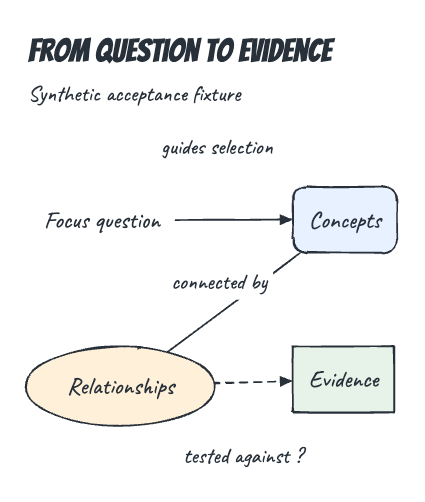
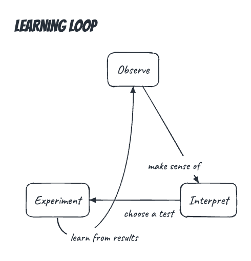
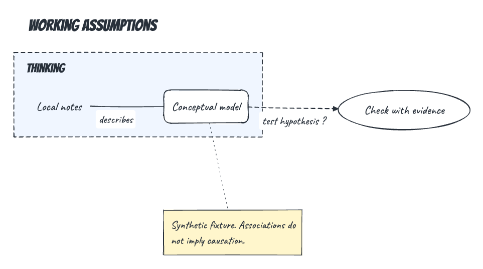

# Sketch Diagram

Create and revise diagrams and shared canvases from natural-language prompts in Codex. The included `diagram` skill builds a diagram specification, runs the local renderer, inspects screenshots, and repairs layout before publishing a reviewed revision. Open the result in a local browser or export SVG and PNG.

The renderer uses TypeScript, Rough.js, bundled fonts, and Playwright. Rendering and storage run locally. Codex handles the language reasoning in your session.

## Example sketches

These images were rendered by this tool from generic synthetic [fixtures](fixtures/). They contain no user subject matter.

### Concept map

Text, different node shapes, labelled relationships, colour, and a dashed hypothesis connection.



Example prompt:

> Use $diagram to map a focus question, concepts, relationships, and evidence. The question guides concept selection. Concepts and relationships have an undirected connection labelled “connected by”. Relationships are tested against evidence. Mark that last connection as a hypothesis.

[Source fixture](fixtures/concept-map.json)

### Feedback loop

A cycle layout with directed relationships and a curved return connection.



Example prompt:

> Use $diagram to draw a learning loop. Observe leads to Interpret, labelled “make sense of”. Interpret leads to Experiment, labelled “choose a test”. Experiment returns to Observe, labelled “learn from results”.

[Source fixture](fixtures/cycle.json). This example has an edge crossing. Automatic layouts can need manual routing or a different arrangement.

### Groups and notes

A dashed group boundary, an attached note, and a hypothesis connecting the model to an evidence check.



[Source fixture](fixtures/groups-notes.json)

Prompts illustrate the intended content. Exact placement can vary with the generated specification.

## Quick start

The installation workflow targets macOS. Other operating systems have not been verified. Requirements:

- Node.js `>=22.19.0 <27` and npm.
- Codex with support for skills, local commands, and image inspection.
- Internet access to install dependencies and Playwright Chromium.

Clone the repository and run:

```sh
git clone https://github.com/JoshuaAdrianJones/diagram-generator.git
cd diagram-generator
npm ci
npm run build
npm run browser:install
npm run install:local -- --json
```

The installer copies the [diagram skill](skill/diagram/SKILL.md) into `${CODEX_HOME:-~/.codex}/skills/diagram`, links it at `~/.agents/skills/diagram`, and links `sketch-diagram` at `~/.local/bin/sketch-diagram`. It preserves unrelated skills and refuses path collisions. Preview the installation with `npm run install:local -- --dry-run`.

Restart Codex if the skill does not appear. Invoke `$diagram` or select Diagram in the skill picker. A custom `/diagram` slash command is not registered.

If `~/.local/bin` is on your PATH, check the installation with:

```sh
sketch-diagram doctor --json
```

Otherwise, use `node bin/sketch-diagram.mjs doctor --json` from the repository directory. The installed skill launcher works independently of PATH and your current directory.

## Create and revise

Use one of the prompts above to create a diagram. The skill handles the JSON specification, rendering, screenshot review, and exports.

To revise the learning loop:

> Use $diagram to rename Experiment to Try a change in the diagram we just made. Keep the arrangement.

Ordinary revisions preserve unrelated positions and sketch seeds. Request a new layout explicitly when you want the whole diagram rearranged. Ask for `spec-only` to inspect the internal JSON without rendering.

The workflow is: convert input, validate, render, inspect actual images, repair if needed, then publish the reviewed revision. A failed candidate leaves the last published revision available. Here, publication means selecting the current revision in local storage.

## Preview and export

```sh
sketch-diagram preview --diagram <id> --open
sketch-diagram export --diagram <id> --format svg,png --scale 2
sketch-diagram preview --stop
```

The preview binds to `127.0.0.1` and reports its actual port. Each diagram has a stable URL with refresh, pan, zoom, Fit, export buttons, and optional diagnostics.

SVG exports embed bundled fonts and retain selectable text. PNG exports support 1x and 2x scale. Use `--background transparent` or a hexadecimal colour such as `--background '#ffffff'`.

See the [CLI reference](docs/cli.md) for commands, draft exports, revision history, review records, and failure codes. The [schema reference](docs/schema.md) describes the specification format.

## Shared canvas

Ask Codex to create several independent diagrams on one canvas, such as an overview and a detailed model of selected concepts. Each frame has its own relationships, layout, and theme. Explanatory links identify what another frame expands. Editing a detailed diagram preserves unrelated overview content and placement.

The skill chooses a path for a sequence, a DAG for directed dependencies, a network for feedback, or ordered lanes for supplied time horizons. It also supports text panels and concentric visual regions. Use sketch or clean presentation, with optional per-frame overrides. Nesting is visual containment and imports are independent snapshots.

```sh
sketch-diagram canvas preview --canvas <id> --open
sketch-diagram canvas export --canvas <id> --format svg,png
sketch-diagram canvas export --canvas <id> --frame <frame-id> --format svg,png
```

The browser provides a frame list, Fit frame, Overview, and clickable explanatory links. Creation and revision remain Codex operations. [Synthetic canvas fixtures](fixtures/) cover overview/detail, graph types, panels, horizons, and nested regions. See the [canvas CLI reference](docs/cli.md#shared-canvases) and [version 2 contracts](docs/schema.md#version-2-graphs-and-canvases).

### Full-feature canvas exercise

Paste this prompt into Codex after installing the current diagram skill. It creates synthetic examples and exercises revisions, validation, review, navigation, and exports. It is longer than a typical diagram request because it also asks for workflow checks.

```text
Use $diagram to create a local shared canvas titled “Synthetic collection study”.
This is a feature exercise using only the invented content below. Keep all specs,
screenshots, reviews, and exports local. Use a new isolated data directory outside
the repository. Do not change existing saved diagrams or installation settings.
Return the directory so I can revisit the examples.

1. Create independent graph frames.

- Overview: a horizontal path, Collect → Sort → Store. Use empty circles with
  labels above and separate captions below: “First”, “Next”, and “Last”.
- Sort detail: a DAG with Receive → Inspect, Inspect → Tag, Inspect → Compare,
  Tag → File, and Compare → File. Group Tag and Compare under “Checks” with a
  dashed boundary. Attach a note to Inspect: “Use the supplied criteria”. Attach
  another note to the group: “Both checks precede filing”. Add a diagram note:
  “This view expands sorting only”.
- Feedback: a network with Sample → Observe labelled “reveals”, Observe → Adjust
  labelled “suggests”, and Adjust → Sample labelled “changes the next sample”.
  Add a second Sample → Observe edge labelled “records”, a reciprocal
  Observe → Sample edge labelled “requests another sample”, and an Adjust
  self-loop labelled “repeat adjustment”. Add an undirected Observe—Archive
  relationship labelled “associated with” and a bidirectional Archive↔Index
  relationship labelled “cross-references”. Mark Adjust → Sample as a hypothesis
  and keep its arrow and uncertainty marking readable. Use deterministic force
  placement. Use text, rectangle, rounded rectangle, ellipse, and circle shapes
  across these five nodes. Emphasize Observe, mute Archive, and emphasize the
  “reveals” edge. Distinguish parallel edges and route the return edge outside.
- Add independent copies of Feedback using flow, radial, cycle, and manual layouts.
  Keep every relationship unchanged. In the manual copy, use compatible fixed,
  pinned, and relative placement constraints. Demonstrate outside labels above,
  below, left, and right without losing their association with their nodes.
- Horizons: ordered lanes “Immediate”, “Intermediate”, and “Later”, with supplied
  captions “Days”, “Weeks”, and “Months”. Add rows “Batch A” and “Batch B”. Each row
  contains Collect in Immediate, Check in Intermediate, and Retain in Later,
  connected Collect → Check → Retain. Also connect Batch A Check → Batch B Retain
  labelled “informs”. Highlight Batch A Check. Do not calculate calendar dates.

Reuse a node ID such as “collect” in different graph frames to exercise local ID
scope. Keep graph relationships inside their owning frames. Record the supplied
elements and relationships as supplied provenance. Do not invent relationships
to satisfy a model or layout.

2. Add explanatory content and style comparisons.

Create three text panels, “Gather”, “Review”, and “Finish”. Each needs a heading,
a paragraph, a quotation, and a list. Use these synthetic facts: Gather records
sample descriptions; Review compares the descriptions against stated criteria;
Finish files the checked descriptions and records open questions. Use the quote
“A description is not a conclusion”. Include one long paragraph that requires
wrapping, strong and muted emphasis, and highlighted text. Include literal text
“<sample> & <criteria>” to check that labels remain inert text.

Add a supplied explanatory link from the overview's Sort node to Sort detail,
labelled “Expands sorting”. Add a frame-wide comparison link between the force
and radial networks. Connect the three panels with “Next stage” links. These
links explain views and never become graph edges. Add a sticky canvas annotation
“Synthetic examples only” and a highlighted annotation “Compare presentations”.

Default the canvas to sketch. Override Sort detail to clean with bundled Noto
Sans. Demonstrate an element style overriding its frame theme. Keep handwritten
fonts and rough geometry in sketch frames. Give a graph its own theme beneath a
frame override to check style precedence. Include graph subtitles and legends.
Let most frames grow to fit measured text; give one panel explicit dimensions
large enough for its wrapped content. Present one attached note as a sticky note.
Start with the default grid, at most three columns and 96 px gaps. Save reviewed
row and column arrangements too, using explicit canvas relayout requests.

3. Add visual nesting and a saved-diagram import.

Insert two small independent path frames, Read → Check and Check → Save, with
explicit positions. Place the first inside an ellipse region “Local context”;
place that region and the second frame inside a larger concentric ellipse
“Whole context”. Add a separate rectangle region around the three panels. Keep
region titles clear of content, satisfy containment, and explicitly place all
region members without overlapping unrelated frames. Regions are visual only.

Create and visually review a separate version 1 clean diagram, Open → Close.
Import its exact published revision as another frame. Retain its source revision
provenance, effective legacy appearance, positions, and seeds. Edit the source
afterward and verify that the imported snapshot does not change.

4. Exercise targeted revisions.

Publish a reviewed baseline. Change only the detail note to “Use the stated
criteria”. Verify that the overview's content, coordinates, and sketch seeds
remain unchanged. Move the detail frame and verify that its internal geometry
and seeds remain unchanged. Relayout only the detail graph. Switch the canvas
theme to clean and back, preserving frame and element overrides and all model
content. Demonstrate a vertical overview path in a separate reviewed revision.
Edit a panel, annotation, explanatory-link label, and canvas title through patches.

Insert a temporary frame and a link to it. Confirm that removal without cascade
is rejected; then explicitly cascade-remove the temporary frame. Also exercise
cascade removal of a referenced graph element and dissolution of a temporary
region without deleting its member frames. Use the current expected base revision
for each atomic patch.

5. Check failure handling on disposable candidates or validation copies.

Confirm rejection of an unresolved frame/element reference, a branching path,
a cyclic DAG, invalid lane membership, and cyclic region containment. Confirm
that undersized explicit frame dimensions produce diagnostics rather than
clipping or shrinking text. Check that a stale-base patch and publication without
complete current screenshot review are rejected. Verify that failed candidates
leave the last published canvas available. Do not publish these invalid examples.

6. Review and navigate the result.

Render and inspect the actual canvas overview and every readable frame tile.
Use targeted captures for dense content. Check label ownership, captions, arrows,
parallel edges, hypothesis markings, panel wrapping, region containment, and
explanatory links routed around unrelated frames and text. Repair only affected
content or placement. Record only screenshots actually inspected, and publish
only a candidate with complete review evidence and no blocking diagnostics.

Open the loopback /c/<id> preview. Exercise Fit canvas, the frame list, Fit frame,
explanatory-link navigation, return to Overview, and refresh after panning and
zooming. Check the canvas read endpoint and local rendering without external
resources. Report controls you could not verify.

7. Export and check revision history.

Export the whole canvas and individual overview, detail, and panel frames as
self-contained SVG and PNG. Include transparent-background exports and 1x/2x
PNG examples. Verify embedded fonts, readable text, full bounds, and omission of
canvas explanatory links from individual frame exports. Check that oversized
PNG requests report the size limit explicitly instead of silently downscaling.

Inspect status and history. Restore the reviewed baseline as a new candidate,
review and publish it, then restore and review the completed composition so it
is the final published result. Exercise cleanup on disposable failed attempts
only, preserving published revisions and exports.

Return the final preview URL, canvas and frame export links, revision IDs, and a
brief checklist of verified features, failures correctly rejected, and anything
not verified. Do not claim visual review or browser checks you did not perform.
```

## Data and privacy

Saved diagrams default to `~/Library/Application Support/sketch-diagram`. Set `SKETCH_DIAGRAM_DATA` to another absolute directory outside the repository to change the location. The installer also accepts `--data-dir <directory>`.

Each successful revision retains its specification, layout, exports, diagnostics, screenshots, and review. Restoring an older revision creates a new candidate and preserves history. To remove old failed attempts without deleting published revisions:

```sh
sketch-diagram cleanup --diagram <id> --age-days 7
```

Keep user subject matter out of GitHub, including private repositories. Store private notes, real diagram specifications, and working images outside the repository or under ignored `.local/`. `.installation.json` and generated `artifacts/` are also ignored. Only generic synthetic examples belong in committed documentation and fixtures. [AGENTS.md](AGENTS.md) defines the repository rules.

Rendering, preview, capture, and export use local resources after installation. No renderer API key or CDN is required. Codex session processing is separate from the local renderer.

## Capabilities and limits

- Text nodes, rectangles, rounded rectangles, ellipses, circles, outside labels, captions, groups, and attached notes.
- Shared canvases with independent overview/detail diagrams, scenario panels, explanatory links, annotations, and nested visual regions.
- Paths, directed acyclic graphs, networks, and ordered time-horizon lanes with optional rows.
- Directed, undirected, and bidirectional relationships, parallel connections, curves, return loops, and self-loops.
- Flow, path, DAG layers, deterministic force placement, lanes, radial, cycle, and manual layouts, with pinned positions and local repair.
- Stable revisions, screenshot review, and self-contained SVG and PNG exports.

There is no drag editor, hosted service, collaboration, Miro synchronisation, or specialised matrix, roadmap, or opportunity-tree layout. Dense diagrams can remain crowded, and paths can cross. The skill attempts up to three repairs and reports unresolved blockers. Geometry checks support image inspection. A review record cannot prove that an agent looked at its images.

Sketch uses Bangers for headings and Caveat for body labels. Version 2 clean diagrams use Noto Sans. All fonts are bundled with their [SIL Open Font License notices](assets/fonts/). Missing fonts or unsupported glyphs produce explicit failures.

## Development

```sh
npm ci
npm test
```

`npm test` builds the TypeScript sources and runs schema, storage, renderer, and browser integration tests. Browser tests need Chromium installed with `npm run browser:install`. Installer changes also require:

```sh
npm run test:integration-install
```

Use synthetic fixtures and isolate test data from saved user diagrams. Source code lives in `src/`, schemas in `schemas/`, and the canonical skill in `skill/diagram/`.

## Update and uninstall

After updating the source, run `npm ci`, `npm run build`, and `npm run install:local`. Reinstall Chromium if the pinned Playwright browser changes. If you move the repository, run `npm run install:local -- --update` to refresh managed integration paths.

To uninstall, stop the preview and run:

```sh
npm run uninstall:local -- --json
```

Uninstall removes the managed skill, discovery link, command link, and installation metadata. It preserves user diagrams, exports, source code, and browser files.
